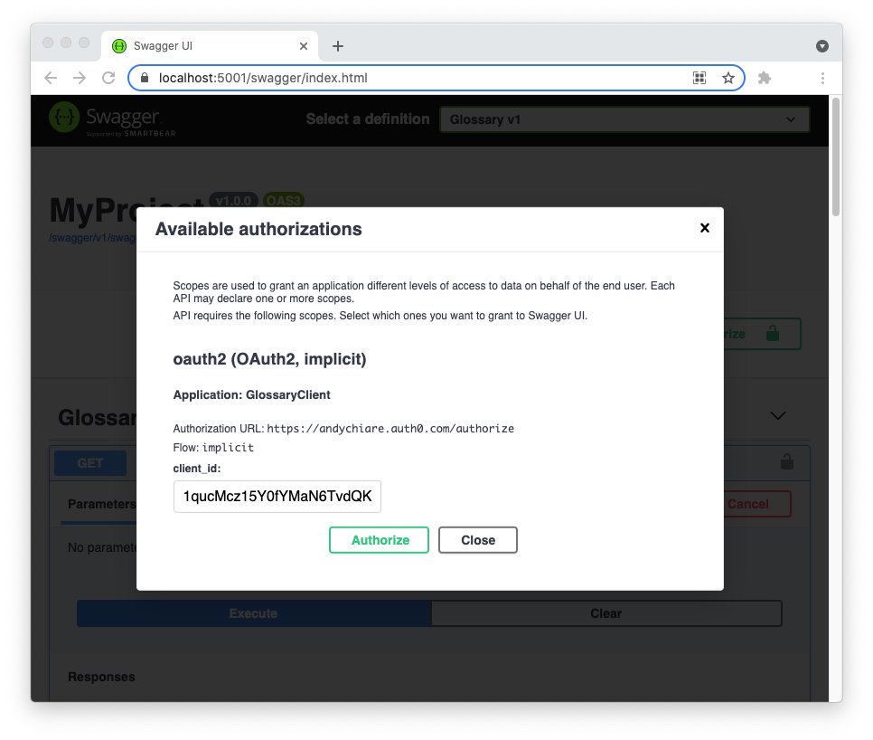

This repository contains a basic glossary CRUD Web API implemented in ASP.NET and secured with [Auth0](https://auth0.com/) using Role-Based Access Control (RBAC).

To learn more about the details of the application implementation check out the [Role-Based Authorization for ASP.NET Web APIs](https://auth0.com/blog/role-based-authorization-for-aspnet-webapi) article.

## To run this application:

1. Clone the repo with the following command: 

   ```bash
   git clone --branch starter --add-rbac https://github.com/auth0-blog/glossary-rbac-web-api-aspnet.git
   ```

2. Move to the `glossary-rbac-web-api-aspnet` folder 

3. Add your Auth0 domain, API identifier, Client Id and Client Secret to the `appsettings.json` configuration file (see [Registering the Web API with Auth0](https://auth0.com/blog/aspnet-web-api-authorization/#Registering-the-API-application-with-Auth0) for more details).

4. Create users and roles as described in the [Auth0 and RBAC]() section.

5. Type `dotnet run` in a terminal window to launch the Web API.

6. Point your browser to `https://localhost:5001/swagger` to test the available endpoints and actions.


6. To call a protected endpoint, you need to click the Authorize button. You will be asked to log in to Auth0 to get an access token and call the API endpoint:
   


## Requirements:

- [.NET Core SDK](https://dotnet.microsoft.com/download/dotnet/current) installed on your machine

